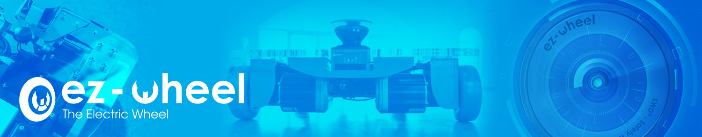

# IDEC ez-Wheel Open Source Community

## Introduction

Welcome to the IDEC-ezWheel GitHub. 

EZ-WHEEL®, A BRAND OF THE IDEC CORPORATION GROUP.

You can also visit our websites:

## Community Resources

Find below a summary of all the resources, documentation and examples available on our GitHub, organized by product range:

* [SWD® Drive & Wheel Drive (CANopen)](https://github.com/IDEC-ezWheel/.github/blob/main/profile/overview/SWD_Drive_%26_Wheel_Drive_(CANopen).md)
* [SWD® Starter Kit with ROS](https://github.com/IDEC-ezWheel/.github/blob/main/profile/overview/SWD_Starter_Kit_with_ROS.md)
* [SWD® Starter Kit with ez-Way®](https://github.com/IDEC-ezWheel/.github/blob/main/profile/overview/SWD_Starter_Kit_with_ez-Way.md)
* [ez-Way® powered solutions](https://github.com/IDEC-ezWheel/.github/blob/main/profile/overview/ez-Way_powered_solutions.md)

## More IDEC Projects

